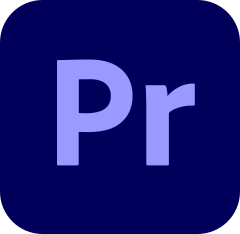

<h1 align="center">Nhaatj💙</h1>
<h3 align="center">Welcome to my Github.</h3>

- 💙 I'm learning everything now.
- ❤️ But I'm currently learning **web** mainly.
- 💚 In 2021, I'm still a student in university.
- 🤍 These are just a little of my very small project.
- 💜 I'm making media production.

### Languages and Tool:

- Languages

- Tools

